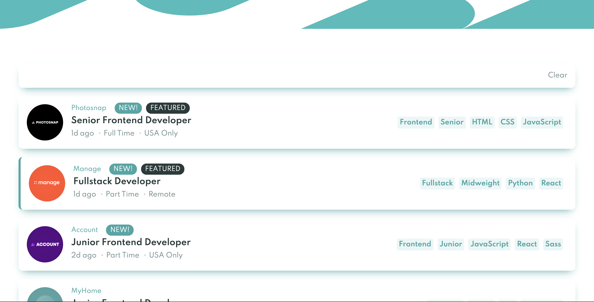

# Frontend Mentor - Job listings with filtering solution

This is a solution to the [Job listings with filtering challenge on Frontend Mentor](https://www.frontendmentor.io/challenges/job-listings-with-filtering-ivstIPCt). Frontend Mentor challenges help you improve your coding skills by building realistic projects.

## Table of contents

- [Frontend Mentor - Job listings with filtering solution](#frontend-mentor---job-listings-with-filtering-solution)
  - [Table of contents](#table-of-contents)
  - [Overview](#overview)
    - [The challenge](#the-challenge)
    - [Screenshot](#screenshot)
    - [Links](#links)
  - [My process](#my-process)
    - [Built with](#built-with)
    - [What I learned](#what-i-learned)
    - [Continued development](#continued-development)
    - [Useful resources](#useful-resources)
  - [Author](#author)
  - [Acknowledgments](#acknowledgments)

**Note: Delete this note and update the table of contents based on what sections you keep.**

## Overview

### The challenge

Users should be able to:

- View the optimal layout for the site depending on their device's screen size
- See hover states for all interactive elements on the page
- Filter job listings based on the categories

### Screenshot

### Links

- Solution URL: [Add solution URL here](https://your-solution-url.com)
- Live Site URL: [Add live site URL here](https://your-live-site-url.com)

## My process

### Built with

- React
- Vite
- CSS
- Typescript

### What I learned

This was my first experience with using Vite, so I learnt how to create a project template with Vite from scratch.
Interestingly, Vite allows users to retrieve import URLs using the import.meta module.

### Continued development

While developing this website, I realised a need for CSS Modules to avoid class names in different files from overriding styles.

### Useful resources

- [Vite](https://vitejs.dev/guide/why.html) - This helped me to understand Vite.

## Author

- Website - [Chow Jia Ying](http://c-likethis123.github.io/website)
- Frontend Mentor - [@C-likethis123](https://www.frontendmentor.io/profile/C-likethis123)

